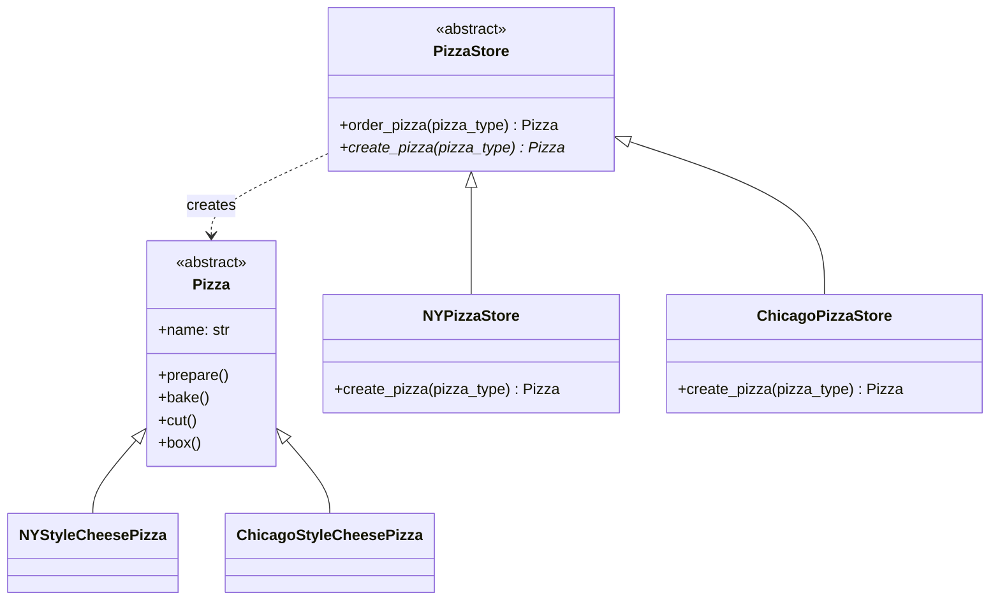

# 工厂方法模式（Factory Method）示例：Pizza Store（Python）

> 对应示例文件：`pizza_store.py`

## 1. 模式原理

### 1.1 意图（Intent）
将对象创建的责任延迟到子类（具体工厂），使得父类只定义创建接口与业务骨架，不直接依赖具体产品类。

一句话：**把“创建什么对象”这个变化点，从通用流程中分离出来。**

### 1.2 适用场景
当你满足以下任一情况时，适合使用工厂方法模式：

- 业务流程稳定，但产品类型经常变化（新增/替换/地区化差异）。
- 调用方不希望（或不应该）直接 `new` 具体实现类。
- 希望通过扩展子类，而不是修改主流程代码来支持新产品。

### 1.3 关键参与者
- **Product（抽象产品）**：`Pizza`
- **ConcreteProduct（具体产品）**：`NYStyleCheesePizza`、`ChicagoStyleCheesePizza`
- **Creator（抽象创建者）**：`PizzaStore`（定义 `order_pizza` 流程 + 抽象 `create_pizza`）
- **ConcreteCreator（具体创建者）**：`NYPizzaStore`、`ChicagoPizzaStore`

### 1.4 与教材 / GoF 描述对照
- GoF 关注点：`Creator` 提供工厂方法，子类决定实例化哪个 `ConcreteProduct`。
- 本示例中：
  - `PizzaStore.order_pizza(...)` 固定了“准备/烘焙/切分/打包”的稳定流程；
  - `create_pizza(...)` 作为扩展点交由 `NYPizzaStore` / `ChicagoPizzaStore` 实现；
  - 同一 `pizza_type="cheese"` 在不同门店返回不同具体产品，体现“创建延迟到子类”。

### 1.5 Mermaid 简易类图



---

## 2. 示例故事与代码映射

### 2.1 示例故事
同样是“cheese pizza”，纽约店和芝加哥店的做法、风格不同。客户下单流程一致，但“具体创建哪种披萨”由门店决定。

### 2.2 一一对应关系

| 业务概念 | 代码元素 | 说明 |
|---|---|---|
| 统一下单流程 | `PizzaStore.order_pizza` | 封装稳定步骤（prepare/bake/cut/box） |
| 创建差异点 | `PizzaStore.create_pizza` | 抽象工厂方法，子类实现 |
| 纽约门店 | `NYPizzaStore` | 决定返回 `NYStyleCheesePizza` |
| 芝加哥门店 | `ChicagoPizzaStore` | 决定返回 `ChicagoStyleCheesePizza` |
| 具体产品差异 | `ChicagoStyleCheesePizza.cut` | 覆写切片逻辑（方形切片） |
| 客户下单入口 | `main()` | 演示两个门店下单输出差异 |

### 2.3 运行时调用主线
1. 客户调用 `store.order_pizza("cheese")`。
2. `order_pizza` 内部先调用 `create_pizza("cheese")` 获取具体产品。
3. 对产品执行统一流程：`prepare -> bake -> cut -> box`。
4. 返回产品对象并输出订单信息。

---

## 3. 运行说明

### 3.1 目录结构

```text
python-factory-method/
└─ pizza_store.py
```

### 3.2 依赖与版本
- **Python**：建议 `3.10+`（本示例使用类型注解与 `from __future__ import annotations`）
- **第三方库**：无（仅标准库 `abc`）
- **JDK**：N/A（本仓库为 Python 示例）

### 3.3 运行命令
在 `python-factory-method/` 目录下执行：

```bash
python3 pizza_store.py
```

Windows（若 `python3` 不可用）可使用：

```bash
python pizza_store.py
```

### 3.4 预期输出（示例）

```text
--- Making a NY Style Sauce and Cheese Pizza ---
Preparing NY Style Sauce and Cheese Pizza
Bake for 25 minutes at 350
Cutting the pizza into diagonal slices
Place pizza in official box
Ethan ordered a NY Style Sauce and Cheese Pizza

--- Making a Chicago Deep Dish Cheese Pizza ---
Preparing Chicago Deep Dish Cheese Pizza
Bake for 25 minutes at 350
Cutting the pizza into square slices
Place pizza in official box
Joel ordered a Chicago Deep Dish Cheese Pizza
```

---

## 4. 运行截图 + 图注


**图 1 图注：**
同样下单 `cheese`，`NYPizzaStore` 与 `ChicagoPizzaStore` 通过各自的 `create_pizza()` 创建不同具体产品；输出中“diagonal slices / square slices”的差异证明了**对象创建由子类决定**，而 `order_pizza()` 的流程保持不变。
